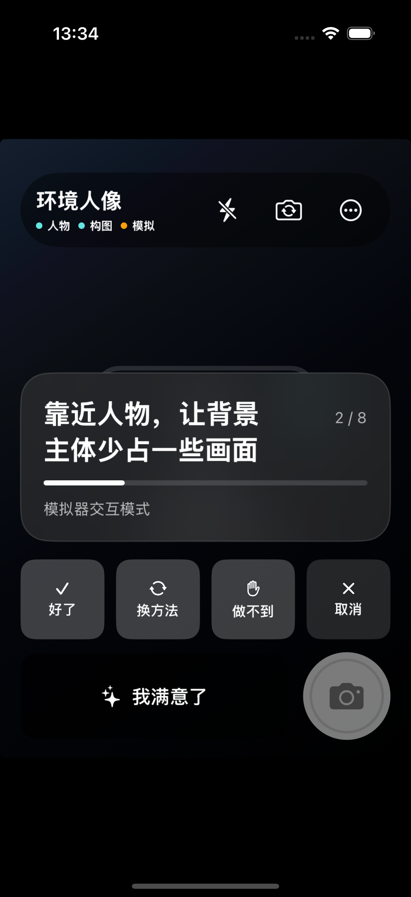

# PhotoGuide MVP v0.2

PhotoGuide 是一个原生 iOS 18 环境人像拍摄指导 MVP。它在设备上运行如下闭环：

`Recipe → 实时观察 → Goal 状态 → Scheduler → 单一动作 → 用户反馈 → 重新观察 → READY → 拍照并保存`

真实 DJev API 尚未接入；当前版本不会用 Mock 结果伪装语义判断。人物、姿态和人物—背景关系由 Vision、手动背景锚点、显著性区域及可解释的本地启发式完成。



## 已实现

- 纯 Swift `GuidanceCore`：Goal 抖动控制、回归、依赖传播、Action 可行性/排序、用户约束、锁定/跳过、READY 与 conformance、Recipe Validator。
- “好了”会等待更新帧后再规划；“我满意了”停止普通优化，但不会掩盖人物缺失/严重出框等 HARD guard。
- AVFoundation 相机权限、竖屏预览、前后摄像头、前摄镜像、闪光灯、点按对焦、拍照。
- Photos add-only 权限、相册保存、成功/失败反馈和拍摄结果页。
- Vision 人体框、完整性、位置、视觉大小、身体姿态；人物短暂丢失或交叉时不会立即静默换绑。
- 用户点选背景主体；Vision 显著性区域与本地构图算法计算相对面积和视觉平衡。
- 一个正式的环境人像 Recipe：8 个 Goal、16 条候选 Action，并提供方向相关的中文指导。
- 完整交互：好了、换方法、做不到、取消、我满意了、锁定当前构图、跳过当前目标、重新开始。
- 模拟器提供明确标记的交互模式，用真实 `GuidanceSession` 验证完整闭环，不冒充相机或 DJev。

## 在 iPhone 上运行

```bash
cd /Users/yohoyes/Projects/poster/PhotoGuide
xcodegen generate
open PhotoGuide.xcodeproj
```

在 Xcode 中选择 `PhotoGuideApp` target，在 Signing & Capabilities 里选择自己的 Team，然后选择一台 iOS 18+ iPhone 运行。

首次使用：

1. 允许相机权限。
2. 让人物进入画面。
3. 点按画面中的建筑、树木或地标作为背景主体；同一次点按也会对焦。
4. 每次只执行一条提示；完成后点“好了”，或选择换方法/做不到/取消。
5. 到达 READY 后拍照，并允许 add-only 相册权限完成保存。

## 构建与测试

```bash
swift test --package-path Packages/GuidanceCore

xcodebuild \
  -project PhotoGuide.xcodeproj \
  -scheme PhotoGuideApp \
  -sdk iphonesimulator \
  -destination 'platform=iOS Simulator,name=iPhone 16 Pro,OS=18.6' \
  CODE_SIGNING_ALLOWED=NO \
  test

xcodebuild \
  -project PhotoGuide.xcodeproj \
  -scheme PhotoGuideApp \
  -sdk iphoneos \
  -destination 'generic/platform=iOS' \
  CODE_SIGNING_ALLOWED=NO \
  build
```

当前自动验收覆盖：35 个 GuidanceCore 测试、3 个 Recipe/READY 集成测试、4 个本地构图测试、2 个端到端 UI 测试。UI 测试会真实推进 `2/8 → 8/8 → READY → 拍摄门槛`。

## 仍需真机验证

- 不同 iPhone 和复杂户外场景下的预览 FPS、热量与 Vision 稳定性。
- 多人物交叉、遮挡、逆光和极端距离下的跟踪阈值校准。
- 本地姿态/显著性启发式与未来 DJev 结果的准确率对照。
- 实际相机与系统相册权限弹窗后的完整人工走查。

详细验收边界见 [MVP-v0.2-ACCEPTANCE.md](Docs/MVP-v0.2-ACCEPTANCE.md)。
